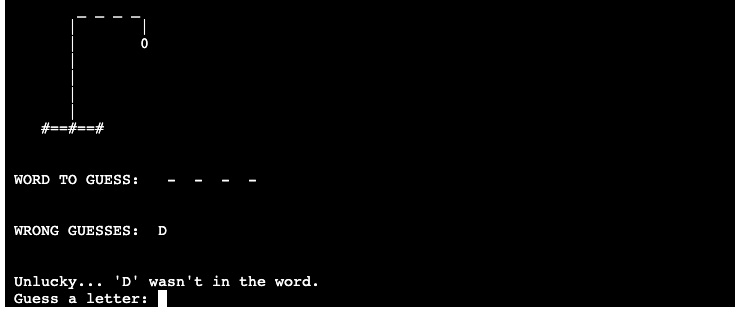

# Harry's Hangman
Harry's hangman is an educational learning game for young people and adults wanting to improve, or have fun with, their English. The game takes the player on a journey to try and save Harry by guessing letters to complete a mystery word.

Each step of the way the play reads and then responds to text on the screen to try and complete the mission. Lovely custom graphics help to build an imaginary world and keep the player engaged with the game. 

The player can choose to guess from either colour or animal words.

## Features
***
- Welcome screen
    - A vibarent image that displays the name of the game
    - The instructions are in uppercase to represent text that should be read  
    - To help the player slowly understand that this is a 'keyboard' based game, the player is asked to press 'return' to start
    - Intentionally, at this stage the player can press any key combination to enter the game. No error message will be shown. We do not want the player to disconnect from the game.

- Player chooses game type
    - Friendly lowercase-text is presented to the user to welcome them to the game. Throughout the game lowercase text is used to represent the games 'voice' to the player. The character of the game is fun, friendly and positive. 
    - At this stage the player can choose one of two options. The player must enter their choice correctly, if entered incorrectly the game will show a message asking them to try again.
    Along with asking the player to select a game, we are training the player on how the actual game will be played. Going forwards the player will need to read the text and then respond accordingly.

- New game start screen
    - A image representing a small village with a church, house and tree is displayed. This image helps the player imagine a place, back in time, where a hanging might have taken place. A little gruesome, but the fun feel to the game counteracts that feeling.
    - The type of word is displayed to help remind the player of kind of word they need to find.
    - The word to guess is clearly displayed, with dashes '-' replacing the letters of the word.
    - The game asks the player for their first guess
    - Uppercase represents game information and lowercase represents the text that is guiding the player.

- Correct Guesses
    - As the player plays the game the displayed screen is consistent. 
    - The hangman graphic shown. 
    - On a correct answer the letter is added to the guess word.
    - Wrong guesses are shown to remind the player of previous guesses.
    - The player is congratulated. 

- Incorrect Guesses
    - As with the correct answers, the displayed screen is consistent.
    - For an incorrect answer the hangman graphic builds an extra section of the figure.
    - The incorrect guess is added to the list of wrong guesses.
    - The player is shown an 'unlucky' message and asked for their next guess.

- Error messages
    - The game detects if a player enters the same letter twice, more than one letter at a time or a numeric character.
    - For each error the player is shown a unique message.
    - Error messages can easily turn a player off from a game. In this cases fun and positive wording is used to create a less negative feeling for the player. They are kindly reminded to take note of the message and to take their time in choosing their next guess.

- End screen: Player lost
    - If the player has 6 wrong guesses an end screen is shown.
    - A large graphic is displayed, showing a tombstone, that links to the start image.
    - The message encourages the player to play again.
    - The player can either start a new game or exit to the home screen.

- End Screen: Player won
    - If player has completed the word, within 6 wrong guess, an end screen is shown
    - A large graphic is displayed showing a happy Harry thanking the player.
    - The message on the screen congratulates the player
    - Like with the 'player lost' end screen, the player can either play again or head back to the home screen.

### Future Features
- Random response to correct or incorrect answers
    - A wide range of responses would make the game engaging for longer periods.
- More word catagories
    - Transport
    - Countries
    - body parts
    - Clothes
    - Kitchen items
    - Sports

## Testing
***

This game works as intended. Having viewed players of various ages interacting with the game I can confidently say that the product delivers as intended. 

The use of text and graphics helps the game function very well and the communication level feels right for the target audience.

Harry's Hangman was built in a such way that code could be tested at each stage of the games development. Features were're added systematically, which allowed for focused testing before developing the game further. 

Once 'live' every step of the game was further tested through running processes repeatedly to ensure of a consistent and predictable result. Below are some of the tests carried out:

- wrong input on game choice option
- uppercase and lowercase inputs
- long strings as inputs
- repeated letters
- guessing all letters correctly
- guessing all letter incorrectly
- mix of correct and incorrect guesses
- running new game repeatedly to test random word generator
- short time between inputs

### Validator testing

PIP3 validation was carried out via the GitPod PIP3 plugin. The code shows no errors.

### Unfixed bugs

No bugs were found when running the game within GitPod.

The game is stable when played via Heroku, but I have experienced the odd game 'freeze' during testing. I think this must be an error in the platform rather than the code, as the actions that caused the freezes are not repeatable.

## Deployment
***
The game is deployed through Heroku.com. The following steps were taken:
- Create new app in Heroku
- Within settings add Python and Node.js to 'Framework'
- Within deploy
    - Deployment method = GitHub (link account)
    - App connected = select the correct repository
    - Click on 'Deploy Branch' to deploy

The live link to the game can be found here:  [harry-hangman.herokuapp.com](https://harry-hangman.herokuapp.com/)

## Credits
***
I have worked alone for this project and all of the code is my own unless stated. 

I created all the artwork and graphics used in this game.

I referenced the code institute 'Project 3: Walkthrough' and a number of websites to help me in completing this game. They are listed below:

- Reference for Python lists: [w3C](https://www.w3schools.com/python/python_lists_comprehension.asp)
- Understanding lists and indexes: [Guru99](https://www.guru99.com/python-list-index.html)
- Modifying lists [Datatofish](https://datatofish.com/modify-list-python/)
- List comprehension: [Realpython.com](https://realpython.com/list-comprehension-python/)
- Check if list is empty: [Flexiple](https://flexiple.com/python/check-if-list-is-empty-python/)
- Working with empty variables: [Eyehunts.com](https://tutorial.eyehunts.com/python/if-a-variable-is-empty-python-example-code/#:~:text=Print%20True%20if%20the%20variable,0%2C%20and%20the%20None%20value
)
- Printing Lists[Decalage.info](https://www.decalage.info/en/python/print_list)
- Checking if something exists in a list: [Stechies.com](https://www.stechies.com/check-item-exists-list/)
- Modify global list from within a function: [Stackoverflow](https://stackoverflow.com/questions/31435603/modify-global-list-inside-a-function)
- How to use global variables: [Thispointer](https://thispointer.com/python-how-to-use-global-variables-in-a-function/)
- Increment and decrement operators: [Pythonguides](https://pythonguides.com/increment-and-decrement-operators-in-python/#:~:text=In%20python%2C%20if%20you%20want,a%20variable%20value%20by%201.&text=After%20writing%20the%20above%20code,is%20incremented%20by%20%E2%80%9C1%E2%80%9D
)
- String to list: [Simplilearn](https://www.simplilearn.com/tutorials/python-tutorial/list-to-string-in-python)
- String numbers: [Nkmk.me](https://note.nkmk.me/en/python-str-num-determine/)
- Check error from Heroku: [Stackoverflow.com](https://stackoverflow.com/questions/5552555/unicodedecodeerror-invalid-continuation-byte)
- Counting letters in string: [Codeacademy](https://discuss.codecademy.com/t/python-how-to-count-number-of-letters-in-a-string/78055)
- Adding to a list: [Digitalocean](https://www.digitalocean.com/community/tutorials/python-add-to-list)
- Truncate a list: [Geeksforgeeks.org](https://www.geeksforgeeks.org/python-truncate-a-list/)
- Convert string to list: [Geeksforgeeks.org](https://www.geeksforgeeks.org/python-program-convert-string-list/)
- split string into list of characters: [Geekforgeeks.org](https://www.geeksforgeeks.org/python-split-string-into-list-of-characters/)
- Replacing values in a list: [Geeksforgeeks.org](https://www.geeksforgeeks.org/how-to-replace-values-in-a-list-in-python/#:~:text=We%20can%20replace%20values%20inside,new%20value%20using%20list%20slicing)
- Replace item in a list: [Careerkarma.com](https://careerkarma.com/blog/python-replace-item-in-list/)
- Calling functions: [Pythonbasics.org](https://pythonbasics.org/multiple-return/#:~:text=As%20you%20already%20know%20a,directly%20from%20the%20function%20call)

